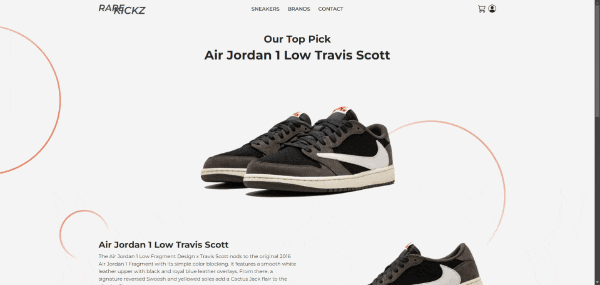

<h1 align="center" style="font-weight: bold;">RareKickz E-Commerce Web</h1>

  <a href="#tech">Technologies</a> •
  <a href="#started">Getting Started</a> •
  <a href="#arch">Architecture</a>

    <b>Front End e-commerce application for buying sneakers.</b>

<h2 id="technologies">💻 Technologies</h2>

- 
- 
- 

<h2 id="started">🚀 Getting started</h2>
<h3>Prerequisites</h3>

- [Node.js](https://nodejs.org/en/download/package-manager)
- [TypeScript](https://www.npmjs.com/package/typescript)

<h3>Environment Variables</h3>

- There are three environment in total `apiUrl`, `keycloakUrl` and `production`. When running in development mode the `apiUrl` is set to `http://localhost:8080`, `keycloakUrl` is set to `http://localhost:8090` and `production` is set to `false`. You can find the environment files in `src/environments/` folder, and in order to build the application for production execute the following command `npm run build-prod`.

<h3>Starting the Project</h3>

- Clone the project, install the node dependencies by running `npm install` and then you can start the application with `npm run start` if the backend is started correctly.

<h2 id="arch">⛩️ Architecture</h2>
<h3>Modules</h3>
The e-commerce front-end application is divided into several smaller modules, each responsible for managing a specific domain.

- Brands – Responsible for displaying the available brands in the application.
- Contact – Contains a simple contact form for users to reach out.
- Home – Displays the home screen, featuring a selected premium sneaker and a basic grid of sneakers.
- Orders – Manages the display of order details after payment is completed or if the order fails for any reason.
- Sneakers – Provides a grid for users to search through sneakers, along with individual previews where users can select a sneaker size and add items to the cart.
- Shopping Cart – Manages the final checkout process and redirects the user to the Stripe payment gateway to complete the purchase.
